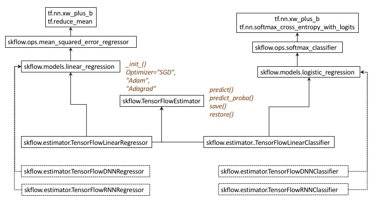
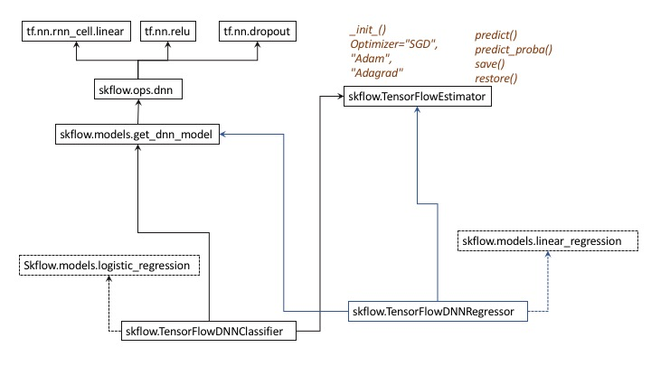
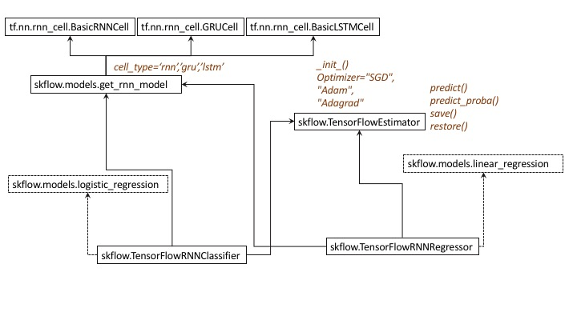

## Experimental Package
  The deepLearnR package was developed as a class project for Stanford [Stats290-Paradigms in data](http://goo.gl/3QNwUr) under [Professor.Balasubramanian Narasimhan](https://goo.gl/m4Syo5).
  
  This is an initial version of the package. It works, but has opportunities for optimizations. We have turned on verbose 1:trainer prints the progress.  

## Goals
  There are at least two sets of users of TensorFlow - first the Data Scientists/Statisticians (who want to implement the machine learning abstractions) and the other AI researchers(who want to create complex computational graphs as part of various experiments). With deepLearnR, we address the goals of the first audience (i.e. to implement machine learning algorithms) leveraging the deep learning paradigms and the scalability of TensorFlow. And this project focusses on a subset of the audience - folks who program in R. 

  The main use case that we envision would be developing deep learning models for predictive analysis in R, beyond the narrow use case of images.  At first we see this package being used as part of R ensembles - deep learning models being one or more  of the models in ensembles. The data will be in R, the model will be in tensorflow (leveraging the multi-core and multi machine (future) capabilities of the tensorflow framework) and the results will be in the R layer. The Ensemble models have a lot of advantages with different paradigms and deep Learning is an effective toolset to have as an ensemble.

  We envision the users to use R for optimizing hyperparameters for various Deep Learning Models - number of neurons, the learning rate. While in the context of this project we might expose only a few useful (and obvious) hyper parameters that pertain to the network architecture, as the package matures there will be more hyper parameters.

  Ultimately the benefit is for the R community to leverage the TensorFlow framework as a backend engine, seamlessly across CPUs and GPUs, distributed across multiple machines.

## Stacks

	There are multiple deep learning stacks that we can leverage - Theano, Torch and TensorFlow. We chose TensorFlow but the package can be enhanced with interfaces to Theano and probably Torch. 
	
	Even with TensorFlow there are multiple paths. Currently, as of v 0.7.0, TensorFlow is divided between python and C++. The graphs are created in python and executed in the C++ layer. So we use rPython and interface with the python layer. As we were researching, other alternatives like Keras and Scikit Flow (Skflow) emerged that have interesting abstractions over tensorflow. Of these, Skflow is much more streamlined for Data Scientists’ work and it’s goal matches with our goal ie provide ML abstractions for data scientists.

  While users can write rPython to evoke TensorFlow or Scikit Flow, they will have to stitch together multiple classes, method and abstractions to perform normal ML activities. The goal of deepLearnR is provide a set of unified R interfaces (“structured machinery” as it is called)  irrespective of the underlying frameworks. In fact a unifying interface and the capability to select the appropriate framework would be a goal when the package is fully developed. 
  
## Interfaces
   
   DeepLearnR exposes interface to most useful abstractions in TensorFlow via the skflow API. First let us start with the class diagrams of skflow as shown below.
   
   
   

## Agonies & Ecstasies

1. Our challenges were getiing the various layers viz. R,rPython, python interpreter, Tensorflow python and tensorflow C++ layer
    * For example rPython will not work with anaconda distributions of python
    * In Mac, installing tensorflow 0.6.0 on default Puthon raised errors - because some of the components are secured against changes
    * There were initial errors which disappeared after sometime, still a mystery to us how they were solved
2. We were able to corall the interfaces to 3 Network Types ("linear", "rnn", "dnn") X 2 Activations("ReLU","tanh") X 3 rnn types ("rnn","gru","lstm") X 3 Optimizers ("SGD", "Adam", "Adagrad"). While this simplifies the interface, all permutations are not valid. There is an opportunity to streamline the interface - may be split into linearNN, DNN & RNN.
3. Once the interface is streamlined, it offers an elegant flexible way to create different nn architectures over a distributed tensorflow framework. For example a 3 layer deep neural network can be created by nnType="dnn" and hiddenUnits=c(10,20,10). Later it can be changed to a 4 layer hiden layer by changing hiddenUnits=c(10,20,20,10)
4. We wanted the interface to be as complete as possible, and that is why we have included rnn. The code 
5. We haven't implemented ConvNets. Ran out of time. CovNets have more complex architectures and probably would need more richer parameters to be flexible in defining the architectures. As the covnets could be possibly have a different interface, we didn't add it to the list
6. We didn't get time to test the Optimizers Adam & Adagrad. We used SGD. This is a straightforward addition, but needs to be tested and verified against 2 or 3 datsets.

  